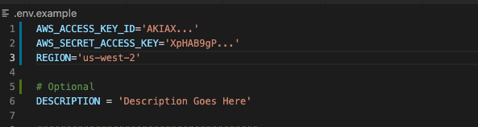

# Fetch Rewards Coding Assessment - DevOps Engineer

Develop an automation program that takes a YAML configuration file as input and deploys a Linux AWS EC2 instance with two volumes and two users.

Here are some guidelines to follow:

Create a YAML file based on the configuration provided below for consumption by your appli`cation
You may modify the configuration, but do not do so to the extent that you fundamentally change the exercise
Include the YAML config file in your repo
Use Python and Boto3
Do not use configuration management, provisioning, or IaC tools such as Ansible, CloudFormation, Terraform, etc.

---
<br />

## Requirements

>To run this pythonic program you will need an AWS user with the proper permissions as well as Python - [download](https://www.python.org/downloads)

Prior to running the python script(s), you will need to first create a `.env` file in the root directory.

:bulb: The following code snippets will assume that you downloaded the repo zip and that you have already unzipped it in your `Downloads` directory. The unzipped repo folder name is `fetchrewards-coding-assessment-main`

After downloading or cloning this repo, open the terminal app of your choice. In the terminal, type the following command to `cd` into the root directory:

```sh
cd ~/Downloads/fetchrewards-coding-assessment-main
```

Inside the root directory, we will now create a `.env` file by copying `.env.example`. Here's the terminal command to do that:

```sh
cp .env.example .env
```

### Environment Variables

With our `.env` file created, we now need to paste in the values for the following environment variables: `AWS_ACCESS_TOKEN_ID`, `AWS_SECRET_ACCESS_TOKEN`, and `AWS_REGION`.


After pasting your variables in, your `.env` file should similar to this:



## Deployment

With python downloaded, our `.env` created, and our environment variables set, we can finally run the program with the following command:

```shell
  python3 cli.py
```
  
## Documentation

[Documentation](https://linktodocumentation)

  
## Usage/Examples

```javascript
import Component from 'my-project'

function App() {
  return <Component />
}
```

  
## FAQ

#### Question 1

Answer 1

#### Question 2

Answer 2

  
## Appendix

Any additional information goes here

  
## License

[MIT](https://choosealicense.com/licenses/mit/)

  